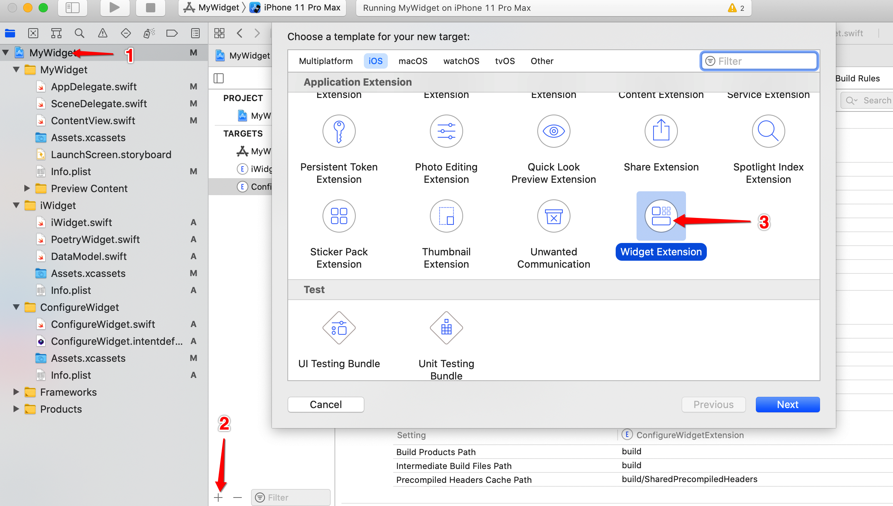
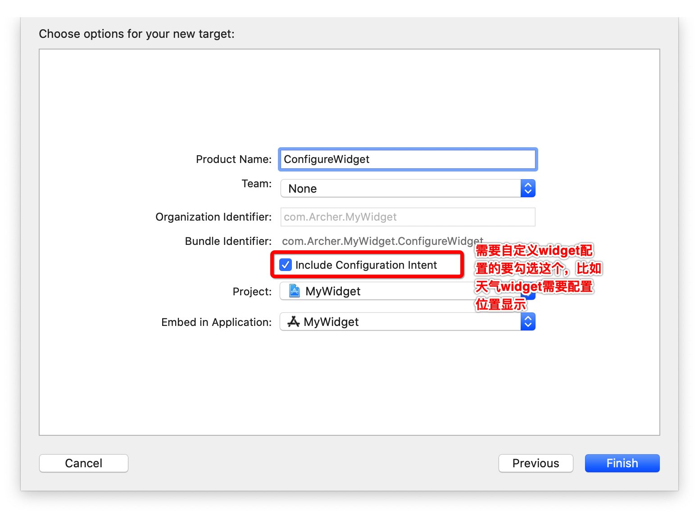
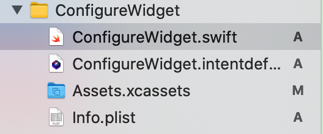
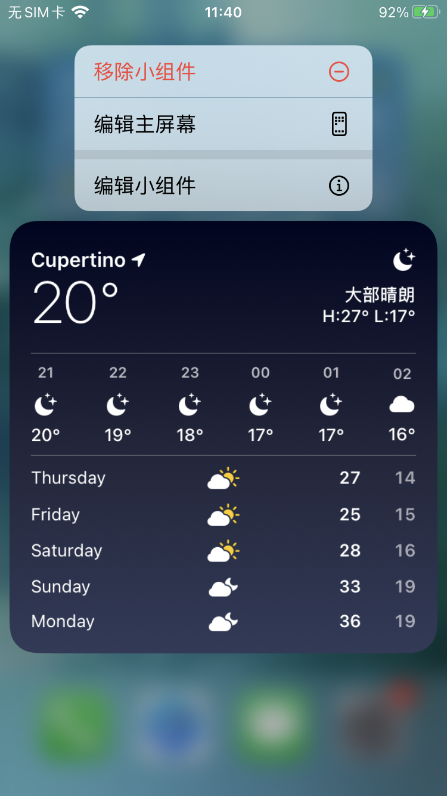
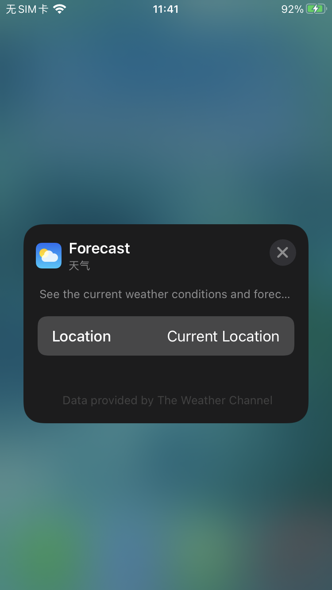
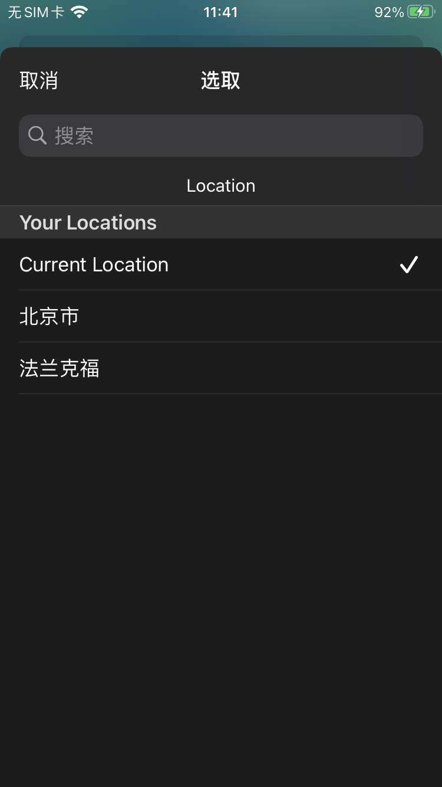
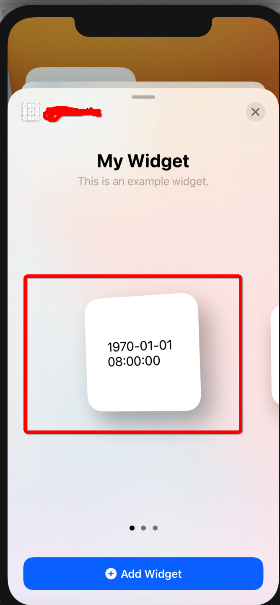

Widget支持iOS 14以上系统，开发必须为swift，布局必须为swift UI

如果要全面理解widget，需要学习（没时间的话只看自己需要的部分）

1.swift [官方中文教程](https://swiftgg.gitbook.io/swift/swift-jiao-cheng)

2.swift UI [Apple官方文档](https://developer.apple.com/tutorials/swiftui/creating-and-combining-views)

但是如果只是完成业务需求，没有太多时间，只看下面widget介绍

首先新建Widget Extention，步骤如下图：



勾选Include Configuration Intent选项，会多生成一个.intentdefinition文件。



这个选项的作用是配置widget控件，比如系统自带的天气，长按显示编辑小组件







>注意：如果勾选Include Configuration Intent选项，并且项目配置类前缀Class Prefix，则生成的.swift文件中ConfigurationIntent类，要手动添加类前缀

先看自动生成的.swift文件，这是一个时钟的widget。编译一下，看能不能成功。

可以看到里面都是struct：

`struct ConfigureWidget: Widget`widget入口，也负责整体项目配置

`struct ConfigureWidgetEntryView : View`负责UI相关

`struct Provider: TimelineProvider`数据的提供者

`struct SimpleEntry: TimelineEntry`数据模型

`struct ConfigureWidget_Previews: PreviewProvider`xcode热重载配置文件

可以看到整体是一个MVVM结构。

这几个struct都可以重命名，对应更改里面的配套名字就可以，比如更改SimpleEntry数据模型，那么传递的数据模型都需要更改。


###1.入口和配置widget的不同样式
入口是遵守Widget协议的struct
```
@main
struct ConfigureWidget: Widget {
    let kind: String = "ConfigureWidget"

    var body: some WidgetConfiguration {
        IntentConfiguration(kind: kind, intent: ConfigurationIntent.self, provider: Provider()) { entry in
            ConfigureWidgetEntryView(entry: entry)
        }
        .configurationDisplayName("My Widget")
        .description("This is an example widget.")
    }
}
```
一个widget Extention只能有一个@main入口。

kind：widget的唯一标识

provider：数据源

return ConfigureWidgetEntryView 返回，UI界面


`.configurationDisplayName("Your Widget")`添加widget界面，显示的标题

`.description("This is an example widget.")`添加widget界面，显示的描述

`.supportedFamilies([.systemSmall])`添加widget界面,显示可以添加的widget样式，默认是small，medium，large三种样式用一套适配，但是一般我们三种样式，会分别适配。有三种方式达到分别适配的效果

#####1.在UI层配置三种模式显示不同的UI
```
struct ConfigureWidgetEntryView : View {
    var entry: Provider.Entry

    @Environment(\.widgetFamily) var family: WidgetFamily

        @ViewBuilder
        var body: some View {
            switch family {
            case .systemSmall: SmallView(entry:entry)
            case .systemMedium: MediumView(entry:entry)
            case .systemLarge: LargeView(entry:entry)
            default: SmallView(entry:entry)
            }
        }
}
```

#####2.返回不同的widget支持不同的样式
不同widget可以返回多个相同样式，比如返回多个small样式的widget
```
@main
struct YourWidget : WidgetBundle {
    @WidgetBundleBuilder
    var body: some Widget {
        SmallWidget()
        SmallWidget2()
        SmallWidget3()
        MediumWidget()
        LargeWidget()
    }
}
```

#####3.新建多个Widget Extention
一个APP有几个完全不同的widget，可以用这种方式，会有多个bundleID


###2.struct SimpleEntry: TimelineEntry数据模型
```
struct SimpleEntry: TimelineEntry {
    let date: Date
    let configuration: ConfigurationIntent
}
```
date是必须要实现的，因为要遵守TimelineEntry协议，他的作用是多久刷新一次数据。

另外自己要实现自己需要的数据模型。

configuration是用户自定义小组件的配置模型，在.intentdefinition文件parameter中添加参数名，选择相应的类型，也可以自定义类型

###3.struct ConfigureWidgetEntryView : View负责UI相关
`struct ConfigureWidgetEntryView : View`因为遵循View协议，所以在var body中用swift UI实现UI相关的代码，每次TimelineProvider中刷新UI，也会走这里的代码，所以这里会有一个数据模型的属性，也就是自己自定义的数据模型属性。

###4.struct Provider: TimelineProvider数据的提供者
这里就是负责加载数据，有下面三个方法
//    没加载到数据前的占位控件，但是经过测试并不会加载这的数据
```
    func placeholder(in context: Context) -> SimpleEntry {
        SimpleEntry(date: Date(), configuration: ConfigurationIntent())
    }
```
    
//    译为屏幕快照，在选择添加控件的地方展示的数据
```
    func getSnapshot(for configuration: ConfigurationIntent, in context: Context, completion: @escaping (SimpleEntry) -> ()) {
        let entry = SimpleEntry(date: Date(), configuration: configuration)
        completion(entry)
    }
```


//    根据时间轴，获取网络真实数据
```
    func getTimeline(for configuration: ConfigurationIntent, in context: Context, completion: @escaping (Timeline<Entry>) -> ()) {
        var entries: [SimpleEntry] = []

        // Generate a timeline consisting of five entries an hour apart, starting from the current date.
        let currentDate = Date()
        for hourOffset in 0 ..< 5 {
            let entryDate = Calendar.current.date(byAdding: .hour, value: hourOffset, to: currentDate)!
            let entry = SimpleEntry(date: entryDate, configuration: configuration)
            entries.append(entry)
        }

        let timeline = Timeline(entries: entries, policy: .atEnd)
        completion(timeline)
    }
```
控制器有自己的生命周期，但widget需要定时获取数据；

默认例子中是5小时执行一次getTimeline，每次加载5条SimpleEntry数据，每小时更新一次UI

`Calendar.current.date(byAdding: .second, value: 5, to: currentDate)`意思是返回当前时间+5秒钟的时间。
```
let timeline = Timeline(entries: entries, policy: .atEnd)
completion(timeline)
```
entries中的数据执行完之后policy: .atEnd立刻completion(timeline)重新获取数据，执行func getTimeline。


policy：.atEnd执行完这个entries，立刻刷新

        .never不刷新，可以调用WidgetCenter.shared.reloadAllTimelines()刷新所有widget，或者指定widget刷新

        .after指定时间刷新

点击事件：

    systemSmall：只能是widgetURL方式跳转

    systemMedium、systemLarge：widgetURL、Link都可以

widgetURL:
```
    var body: some View {
        VStack{
            
        }
        .widgetURL(URL(string: "www.myWidget.com"))
    }
```
Link包裹：
```
var body: some View {
      Link(destination: URL(string: "www.myWidget.com")!){
            VStack{
                
            }
      }
}
```
处理事件点击，相当于处理URL Schemes，iOS14UI生命周期交给了scene
```
    func scene(_ scene: UIScene, openURLContexts URLContexts: Set<UIOpenURLContext>) {
        for context in URLContexts {
                print(context.url)
            }
    }
```
